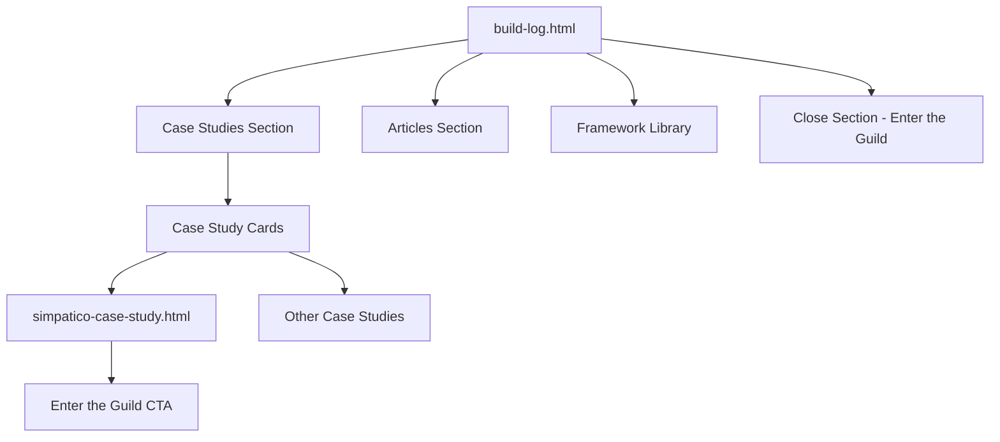

# Build Log Redesign Plan

## Overview
Re-imagine the the build-log.html page and create a case study template system for the MIPLY website.

## Files to Create/Modify

### 1. case-study-template.html (NEW)
A reusable boilerplate page for case studies following the CASE_STUDY_TEMPLATE.txt structure.

**Page Structure:**
- HERO SECTION
  - Headline (placeholder)
  - Subheadline
  - Meta Block: Industry, Duration, Maturity Stage, Focus Area, Performance Domains- SECTION 1 — CONTEXT
  - Operational Environment description
  - Maturity Model positioning

- SECTION 2 — PROBLEM DEFINITION
  - The Performance Constraint
  - Bullet blocks for metrics

- SECTION 3 — ARCHITECTURE ANALYSIS
  - Four-Layer Architecture Model assessment
  - Infrastructure, Data, Workflow, Intelligence layers

- SECTION 4 — DEPLOYMENT STRATEGY
  - Intelligence Deployment Plan
  - Phased approach

- SECTION 5 — IMPLEMENTATION
  - Applied Engineering details
  - Pilot, testing, security

- SECTION 6 — MEASURABLE OUTCOMES
  - Performance Impact metrics
  - Before/After callout blocks

- SECTION 7 — PERFORMANCE DOMAIN ALIGNMENT
  - Five-Domain Framework mapping

- SECTION 8 — MATURITY ADVANCEMENT
  - Stage progression

- SECTION 9 — TRANSFERABLE PATTERN
  - Replicable Architecture Pattern

- SECTION 10 — CLIENT PERSPECTIVE
  - Leadership Insight quote

- SECTION 11 — CLOSE
  - CTA buttons

---

### 2. simpatico-case-study.html (NEW)
A fully populated case study using the SAMPLE_CASE_STUDY.txt content.

**Content Mapping:**
- Headline: "From MSP to Managed Intelligence Provider"
- Subheadline: How Simpatico redesigned workflow architecture...
- Meta Block:
  - Industry: Legal Services
  - Duration: Multi-Phase Deployment
  - Maturity: Stage 3 → Stage 4/5
  - Focus: Workflow Intelligence + AI Decision Support

- All 11 sections populated with Simpatico content
- Metrics: Onboarding 3-5 days → under 1 day, Win rate 40-45% → 65%, etc.

---

### 3. build-log.html (MODIFY)
Update with new content from BUILD_LOG.txt.

**New Page Structure:**
- HERO SECTION
  - Headline: "Build Log"
  - Subheadline: "Field reports, architecture insights, and applied intelligence in action."
  - Body: "The Build Log documents how Managed Intelligence Providers design systems..."

- SECTION 1 — CASE STUDIES
  - Headline: "Intelligence in Practice"
  - Body paragraph
  - Case Study Cards (2-3 cards):
    - Legal Services — Workflow Intelligence Deployment
    - Professional Services — Performance Visibility Framework
  - Button: "View All Case Studies"

- SECTION 2 — ARTICLES
  - Headline: "Architecture Notes"
  - Topics list
  - Article Cards:
    - The Four-Layer Intelligence Stack
    - Workflow Targeting Matrix Explained
  - Button: "Explore All Articles"

- SECTION 3 — FRAMEWORK LIBRARY (Optional)
  - Headline: "Core Frameworks"
  - Framework highlights

- SECTION 4 — STRUCTURE
  - Headline: "Documented. Repeatable. Measurable."
  - Body paragraph

- SECTION 5 — CLOSE
  - Headline: "Intelligence Leaves a Trail."
  - Primary Button: "Enter the Guild"
  - Secondary Link: "Apply for Membership"

---

## Design Patterns to Follow

From reference pages (index.html, what-is-mip.html, guild.html):

### Typography
- Headlines: `text-4xl md:text-5xl lg:text-6xl font-black text-theme-dark`
- Subheadlines: `text-2xl md:text-3xl font-bold text-slate-700`
- Body: `text-slate-600 text-lg leading-relaxed`
- Hand-written accents: `font-hand text-theme-blue`

### Components
- Sketch cards: `sketch-card border-sketch-N`
- Sticky notes: `sticky-note`
- Buttons: `sketch-button` and `sketch-button-blue`
- Markers: `marker-highlight`, `hand-underline`, `pen-strike`

### Layout
- Max width container: `max-w-7xl mx-auto px-4`
- Section spacing: `py-24 border-t border-slate-200`
- Grid: `grid lg:grid-cols-2 gap-12`

### Navigation
- Consistent nav bar across all pages
- Footer with same structure

---

## Mermaid Diagram: Page Flow

---

## Implementation Order

1. **case-study-template.html** - Create the reusable template first
2. **simpatico-case-study.html** - Populate the template with Simpatico content
3. **build-log.html** - Update with new structure and link to case studies

---

## Navigation Updates Needed

- Add case study pages to navigation where appropriate
- Ensure footer links are consistent
- Update any "Case Studies" links to point to build-log.html
